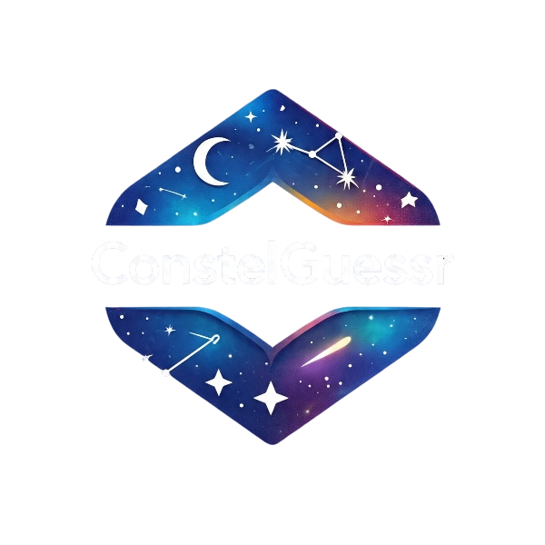

<div align="center">
   
   <h3>Inspiring the astronaut within. Draw a constellation, get an instant guess.</h3>
</div>
<br>

## Overview

ConstelGeussr is a fun, interactive web app where you draw your own constellation by placing and connecting stars. The app uses AI to guess which real-world constellation your drawing most closely matches. With a clean, intuitive UI, it’s a playful way to explore the night sky and test your constellation knowledge!

## Features

- ✨ Draw constellations by placing and connecting stars
- 🤖 AI instantly guesses the closest real constellation
- 🎵 Background music with shuffle and next track controls
- 🌌 Beautiful, animated UI
- 🌓 Works on desktop and mobile

## Getting Started

### Prerequisites

- Python
- Node.js (v18+ recommended)
- npm or yarn

### Installation

1. Clone the repository:

   ```sh
   git clone https://github.com/SupreetTadeparti/ConstelGeussr.git
   cd ConstelGeussr
   ```

2. Install dependencies for both client and server:

   ```sh
   cd client
   npm install
   cd ../server
   pip install -r requirements.txt
   ```

3. Start the backend server:

   ```sh
   cd server
   python app.py
   ```

4. Start the frontend:

   ```sh
   cd client
   npm start
   ```

5. Open [http://localhost:5173](http://localhost:5173) in your browser.

## Usage

1. Draw your constellation by clicking to add stars and connecting them.
2. Click "Predict" and see which constellation the AI thinks you drew!
3. Use the music controls for a relaxing experience.
